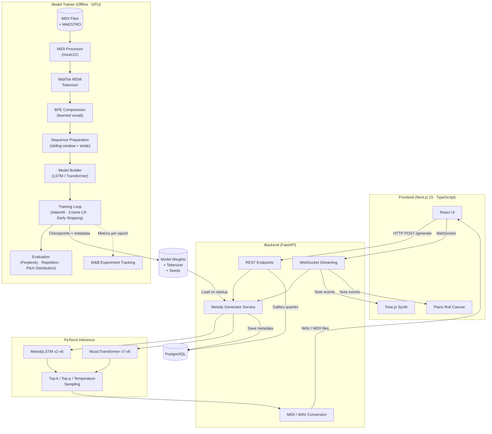

# AI Melody Generator

A full-stack web application that uses deep learning to generate original musical melodies. Built with a Next.js frontend, FastAPI backend, and PyTorch model trainer supporting both LSTM and Transformer architectures.

Try it at [melodygenerator.fun](https://melodygenerator.fun).

## Features

- Generate melodies using multiple AI models trained on different genres
- Play, visualise, and download generated melodies (MIDI and WAV)
- Public melody gallery — all generated melodies are saved and browsable by anyone
- 27 General MIDI instruments (piano, guitar, strings, synths, etc.)
- Advanced generation controls: temperature, top-k, top-p (nucleus) sampling
- Melody continuation from uploaded MIDI files
- Conditional generation with key signature, tempo, and style
- Real-time WebSocket streaming with live piano roll visualisation
- Rate-limited API endpoints
- User authentication with JWT and token revocation

## Architecture



## Tech Stack

| Layer | Technology |
|-------|-----------|
| Frontend | Next.js 15, React 19, Tailwind CSS 4, Tone.js |
| Backend | FastAPI, Uvicorn, asyncpg, Pydantic, slowapi |
| AI/ML | PyTorch, MidiTok (REMI + BPE tokenization), music21 |
| Database | PostgreSQL 16 |
| Infrastructure | Docker Compose |

## Project Structure

```
melodygenerator/
├── frontend/           # Next.js 15 app (TypeScript, App Router)
│   ├── app/            # Pages and layouts
│   ├── components/     # UI components (melody, layout, common)
│   ├── hooks/          # Custom React hooks
│   ├── context/        # React Context (MelodyContext)
│   ├── types/          # Shared TypeScript interfaces
│   └── utils/          # API client, WebSocket helpers
├── backend/
│   ├── api/            # FastAPI application
│   │   └── app/
│   │       └── src/
│   │           ├── routes/     # API endpoints
│   │           ├── services/   # Melody generation logic
│   │           └── database/   # PostgreSQL connection
│   └── postgres/       # DB schema (init.sql)
├── shared/
│   └── models/         # Shared PyTorch model definitions (MelodyLSTM, MusicTransformer)
├── model-trainer/      # Config-driven PyTorch training pipeline
│   ├── configs/               # YAML training configs per model version
│   │   ├── v6-lstm-remi.yaml
│   │   ├── v7-transformer.yaml
│   │   └── v8-transformer-bpe.yaml
│   └── app/
│       ├── train.py           # Single entry point (python -m app.train --config ...)
│       ├── config.py          # Dataclass config + YAML loader with CLI overrides
│       ├── data/              # Data pipeline (processor, tokenizer, augmentation)
│       └── training/          # Unified trainer + LR schedulers
├── models/             # Trained model weights and metadata
│   ├── v2-rnb/         # LSTM model trained on R&B/hip-hop
│   ├── v3-dance/       # LSTM model trained on dance music
│   ├── v4-jazz/        # LSTM model trained on jazz
│   ├── v5-various/     # LSTM model trained on mixed genres
│   ├── v6-remi/        # LSTM with REMI tokenization
│   ├── v7-transformer/ # Music Transformer with REMI + BPE
│   ├── v8-transformer-bpe/ # Music Transformer with BPE 1024
│   └── training-data/  # MIDI datasets used for training
└── docker-compose.yml
```

## Models

| Model | Genre | Training Data | Architecture |
|-------|-------|---------------|--------------|
| v2 | R&B / 90s Hip Hop | 25 songs | LSTM (3x512) |
| v3 | Dance | ~200 songs | LSTM (3x512) |
| v4 | Jazz | ~180 songs | LSTM (3x512) |
| v5 | Various | 275 songs | LSTM (3x512) |
| v6 | Various | 275 songs | LSTM (3x512, REMI) |
| v7 | Various | 275 songs | Transformer (8L/8H/512d, REMI + BPE) |
| v8 | Various + Classical | 275 songs + MAESTRO | Transformer (8L/8H/512d, REMI + BPE 1024) |

### Model Architectures

**LSTM** (v1–v6): 3-layer LSTM with 512 units, optional embedding layer and multi-head self-attention. v1–v5 use legacy pitch-string tokenization; v6 uses MidiTok REMI tokenization.

**Music Transformer** (v7+): 8-layer Transformer with RoPE positional encoding, SwiGLU activations, RMSNorm, 8 attention heads, 512-dim embeddings, 2048-dim feed-forward layers. Uses REMI tokenization with BPE compression and causal masking for autoregressive generation.

### Generation Parameters

| Parameter | Range | Default | Description |
|-----------|-------|---------|-------------|
| Temperature | 0.1 – 2.0 | 0.8 | Sampling diversity |
| Top-k | 0 – 500 | 50 | Keep top-k highest probability tokens |
| Top-p | 0.01 – 1.0 | 0.95 | Nucleus sampling threshold |
| Num Notes | 50 – 2000 | 500 | Number of notes to generate |

## API Endpoints

| Method | Endpoint | Description |
|--------|----------|-------------|
| GET | `/melody/models` | List available models |
| GET | `/melody/instruments` | List MIDI instruments |
| GET | `/melody/conditions` | Available keys, tempos, styles |
| POST | `/melody/generate` | Generate a melody (10/min) |
| WS | `/melody/generate/stream` | Stream generation in real-time |
| GET | `/melody/gallery` | Public gallery of generated melodies |
| GET | `/melody/download/{file}` | Download MIDI/WAV file (30/min) |
| GET | `/health` | Health check |

## Getting Started

### Prerequisites

- Docker and Docker Compose
- Node.js 22+ (for local frontend development)
- Python 3.12+ (for local backend/trainer development)

### Running with Docker Compose

```bash
docker compose up --build
```

This starts:
- **Frontend** at `http://localhost:3000`
- **API** at `http://localhost:4050`
- **PostgreSQL** at `localhost:5432`

### Local Development

**Frontend:**
```bash
cd frontend
npm install
npm run dev
```

**Backend:**
```bash
cd backend/api
pip install -e ".[test]"
uvicorn wsgi:app --host 0.0.0.0 --port 4050 --reload
```

## Model Training

The model trainer is config-driven: each model version is defined as a YAML file and trained with a single command. Supports LSTM and Transformer architectures with REMI tokenization (optional BPE) or legacy pitch-string encoding.

### Training a Model

```bash
# Train v8 Transformer with REMI + BPE
cd model-trainer
pip install -e .
python -m app.train --config configs/v8-transformer-bpe.yaml

# Override paths and enable W&B tracking
python -m app.train --config configs/v7-transformer.yaml \
  --input-dir /data/midi --output-dir /data/models --wandb

# Train LSTM variant
python -m app.train --config configs/v6-lstm-remi.yaml
```

**With Docker (GPU required):**
```bash
docker compose run model-trainer
# Or with a specific config:
docker compose run model-trainer python -m app.train --config configs/v7-transformer.yaml
```

Requires NVIDIA GPU with the Docker runtime configured:
```bash
nvidia-ctk runtime configure --runtime=docker
```

### Training Configuration

Each YAML config specifies the full training run. Example (`configs/v8-transformer-bpe.yaml`):

```yaml
name: melody_generator_transformer_v8
architecture: transformer
tokenizer: remi
bpe_vocab_size: 1024
sequence_length: 256
stride: 64
epochs: 100
batch_size: 64
learning_rate: 3e-4
warmup_steps: 4000
accumulation_steps: 2
early_stopping_patience: 15
```

CLI arguments (`--input-dir`, `--output-dir`, `--wandb`, `--epochs`) override YAML values. Environment variables (`INPUT_DIR`, `OUTPUT_DIR`, `MAESTRO_DIR`) are used as fallbacks.

## Known Issues

- Sound on mobile doesn't work due to MIDI compatibility on devices
- Play/pause with multiple files (sequential playback, play/pause/generate combinations)